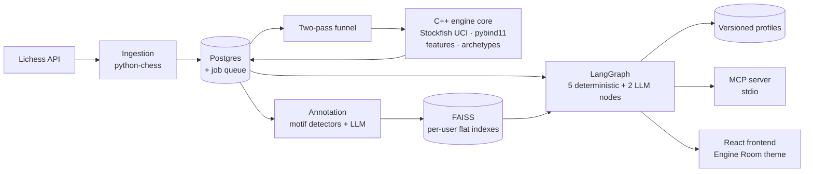
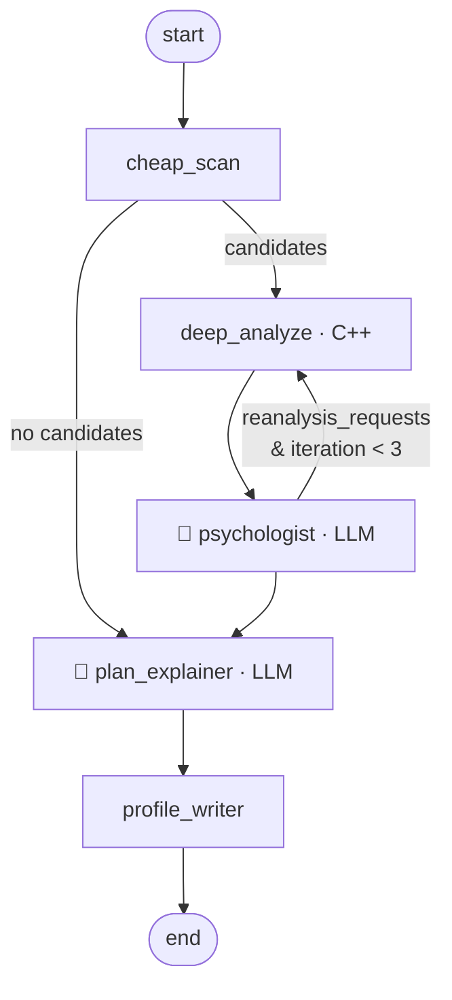

# DESIGN.md — Blunder Psychologist

A chess improvement system that models **your individual failure modes** — not generic engine analysis, but a psychological profile of *how you specifically lose*, grounded in your own game history via RAG, with a Plan Explainer that turns engine lines into verified strategic narratives.

**Stack:** C++ analysis engine (Stockfish/UCI, pybind11) · Python agent layer (LangGraph, LangChain, FAISS, MCP) · TypeScript/React frontend · PostgreSQL · Docker. Entirely free to run: Gemini Flash / Ollama behind one env var, local bge-small embeddings, Postgres-backed job queue, Oracle free-tier hosting path.

**Methodology:** TDD on the deterministic core, eval-driven on the LLM layer. See `EXECUTION_PLAN.md` for the phased build.

---

## 1. System architecture



Multi-user from day one (Lichess username = identity, no auth in v1). Hybrid analysis: a backfill of up to 400 games per user through a priority queue — **configurable sampling strategy** (`recent | random | stratified`, default stratified: ~300 recent + ~100 older for history coverage without staleness) — plus on-demand single games (submitted by Lichess URL or PGN paste) that jump the queue and are analyzed against the existing profile.

## 2. Data model

```
users(id, lichess_username, last_synced_at)
games(id, user_id, pgn, time_control, played_at, book_exit_ply, analysis_status)
move_analyses(id, game_id, ply, fen, move, eval_cp, best_eval_cp,
              delta_cp, sharpness, clock_seconds, phase,
              pawn_archetype, features JSONB)
blunders(id, move_analysis_id, severity, motif_tags TEXT[],
         annotation TEXT, embedding_id)
profiles(id, user_id, version, stats JSONB, narrative TEXT, created_at)  -- append-only
jobs(id, type, priority, status, payload JSONB, attempts, created_at)
```

The job queue is plain Postgres: workers claim with `SELECT … FOR UPDATE SKIP LOCKED`; on-demand jobs run priority 0, backfill chunks priority 10. No Redis, no Celery — deliberately.

## 3. The two-pass analysis funnel

Naive full-history analysis at 2M nodes/move is hours of CPU per user. Instead:

1. **Cheap pass** — Lichess's embedded server evals (where present) or a 100k-node scan flag candidate blunders by eval-delta threshold.
2. **Expensive pass** — the full C++ pipeline (2M nodes, MultiPV 3, feature extraction) runs only on candidates.

Scope rules narrow the funnel further: **only the profiled user's moves** are classified and annotated (≈40 candidate plies per game, not 80 — opponent positions are evaluated only as needed for delta computation, never stored as blunders), and **book moves don't count**: book exit is detected per game via the Lichess opening explorer API (position queried until its games-count drops below threshold; responses cached since positions repeat heavily; flat move-10 cutoff as fallback), stored as `games.book_exit_ply`. Blunder-opportunity counting starts there.

~10x compute reduction overall (measured ratio logged and reported in the README). Bullet games are excluded entirely; rapid and classical are profiled, with time control as a hard profile dimension.

## 4. Engine core (C++)

- Long-lived Stockfish UCI sessions, **`Threads 1` per engine** (multithreaded search is nondeterministic), node-limited `go nodes 2000000` for cross-machine reproducibility, scaled via a process pool.
- Eval-delta semantics: best-move eval minus played-move eval, side-to-move normalized; mate scores mapped to `±(10000 − ply_distance)`.
- **Sharpness** = eval spread across the MultiPV-3 lines; severity thresholds (50/100/250cp) scale with sharpness and are suppressed when |eval| > 600cp.
- Bitboard feature extraction: pawn flags (isolated/backward/doubled/passed), open files, king-shield integrity, king-zone attackers, space, mobility.
- **Pawn-archetype classifier:** 12 structures (Carlsbad, IQP, hanging pawns, Maróczy, Hedgehog, Stonewall, French chain, KID chain, symmetric open/closed, opposite-castling race, endgame-simplified) as hand-coded, ordered bitboard predicates with an honest `unknown` class. Rules over ML: explainable, debuggable, defensible.
- Exposed to Python via pybind11 (`analyze_games` batch API, GIL released).

## 5. Annotation & RAG

Motifs are detected **programmatically first**, in two families. **Tactical** (from engine lines + bitboards): hanging piece, fork, pin, back rank, overloaded defender, missed break. **Positional** (from played-vs-best feature diffs — the position after the played move diffed against the position after the best move): structure damage, tension release, file/diagonal concession, king-shield weakening, bad trade, outpost concession, mobility collapse, wrong pawn break. The LLM writes only what code can't: the *why* and the counterfactual, as strict JSON with a controlled tag vocabulary. Annotations are batched (free-tier limits), cached, immutable.

Detector ground truth: tactical detectors are benchmarked against the **Lichess puzzle database** (~5M puzzles, each generated from a real-game blunder, with theme tags mapping onto the tactical vocabulary — precision/recall at scale for free). Positional mistakes have no public labeled dataset, so the fixture set is **self-mined**: quiet-position eval swings from the Lichess open database where no tactical detector fires, auto-labeled by the feature-diff detectors, with a hand-verified golden subset (~100 positions).

Retrieval is **hybrid**: SQL metadata pre-filter (phase × clock bucket × archetype × severity) → FAISS `IndexFlatIP` per user → top-k semantic search (bge-small embeddings). Flat over HNSW/IVF because per-user corpora are 2–10k vectors — exact search is cheap below ~100k and ANN overhead is unjustified.

This makes the RAG load-bearing: the Psychologist grounds every claim in retrieved *past mistakes by this player*, not vibes.

## 6. The agent graph (LangGraph)

Design stance: **don't make everything an agent.** Deterministic work stays in plain function nodes; LLM reasoning appears in exactly two places.



State: `game_id, candidate_blunders, deep_analyses, retrieved_history, profile_delta, explanations, reanalysis_requests, iteration`. Postgres checkpointer; killed runs resume. The Psychologist can route back for deeper analysis on suspected recurring patterns (higher nodes, MultiPV 5), guarded by an iteration cap.

## 7. Plan Explainer: verified narration

The anti-hallucination design: **PV feature-diffing.** The principal variation is replayed in C++ and positional features are diffed at start/end/key points ("e-file opens, d5 becomes passed, Black's king shield loses the f-pawn"). The LLM narrates only these computed facts.

On top: a curated YAML **plan book** — 2–4 canonical plans per archetype (Carlsbad → minority attack or central break; IQP → d4–d5 or kingside attack), each with a signature move. A consistency check requires the signature move in the PV before the named plan may be cited; otherwise pure diff narration. Pass rate is logged — the one rigor metric shipped in v1.

## 8. Player profile

Dual representation, versioned append-only:

- **Stats (JSONB):** blunder rates by phase × clock bucket × archetype × motif, every rate with a denominator (opportunities faced), small-n cells shrunk toward the player mean.
- **Narrative:** LLM-synthesized from stats + retrieved exemplars, updated *incrementally* (previous narrative passed in) — the profile evolves, and versions can be diffed over time.

**Voice contract (applies to both LLM nodes):** supportive coach. Data is stated with full honesty and never softened ("you captured in 4 of 5 cases"), patterns are framed as fixable, and every observation ends with the actionable alternative. Honest numbers, encouraging frame.

## 9. MCP surface

stdio transport; tools `analyze_game`, `get_player_profile`, `find_similar_blunders`, `explain_plan`; the profile additionally exposed as a **resource** (`profile://{username}`). Claude Desktop becomes a full frontend with zero custom UI.

## 10. Evaluation

v1: JSON schema-validation tests on all LLM boundaries + the plan-consistency pass rate. v2: **predictive validity** — hold out the player's latest 20 games and test whether the profile predicts where blunders actually occur, turning the product into a falsifiable model. Deferred deliberately: demo first, rigor second.

---
## 11. Frontend design — "Engine Room"

Amber-phosphor telemetry console. The aesthetic argues the product thesis: every claim on screen is grounded in engine output, so the UI reads like sitting inside Stockfish. Live mockup: `mockup-engine-room.html` (open in any browser).

### Design tokens

```css
:root {
  /* color */
  --bg:        #0c0d0b;  /* near-black ground */
  --panel:     #101109;  /* card surface */
  --line:      #26271f;  /* hairline borders */
  --ink:       #bdb38c;  /* body text, desaturated parchment */
  --ink-dim:   #8a8468;  /* secondary text */
  --phosphor:  #f2b53e;  /* amber accent: headers, highlights, board "from" square */
  --ember:     #f07850;  /* errors only: ?? glyphs, eval spikes, target squares */
  --pv-green:  #7d9a52;  /* engine PV readouts */
  /* board */
  --sq-light:  #1f2018;
  --sq-dark:   #15160f;
  /* type: JetBrains Mono everywhere; Inter only for micro-labels */
}
```

Rules of the theme: monospace is the default voice, not an accent. Amber is structure and attention; **ember is reserved exclusively for error semantics** (blunder glyphs, eval spikes, target squares) so red always means "mistake." Pieces get a faint amber glow (`drop-shadow`). Borders are 1px hairlines, radius 4px, no shadows except the piece glow.

### v1 layout (mobile-first)

```
┌─────────────────────────────────┐
│ BLUNDER://move-18 · trace       │  header, uppercase mono
│ user · rapid 10+0 · carlsbad    │
├─────────────────────────────────┤
│ [Move 18·Black] [⏱2:41] [??Δ250]│  status chips
├─────────────────────────────────┤
│                                 │
│         8×8 chessground         │  glowing pieces,
│   b5 = amber ring (from)        │  square highlights
│   c6 = ember ring (target)      │
│                                 │
├─────────────────────────────────┤
│ 15.Rab1 Re8 │ 16.a4 │ …cxb5?? │ │  move strip, h-scroll,
│                       ≻18…c5!   │  glyphs, tap → jump
├─────────────────────────────────┤
│ ▁▁▂▁▂▁▂█   −0.1 → +2.4         │  eval cliff (hand-rolled
│            EVAL SWING           │  SVG, ember spike dot)
├─────────────────────────────────┤
│ ◈ BLUNDER PSYCHOLOGIST          │  card: pattern synthesis,
│   pattern · evidence chips      │  streamed via SSE
│   [carlsbad·n=11][clock<3:00]   │
├─────────────────────────────────┤
│ ◇ PLAN EXPLAINER                │  card: plan narrative +
│   PV 19.bxc6 … ▸ +2.4           │  raw PV readout with
│   plan check: ✓ minority-attack │  consistency verdict
└─────────────────────────────────┘
```

Desktop: board left (sticky), move strip + eval + cards in a right column. The **signature element** is the PV readout block — raw engine telemetry (green mono on black) with the plan-check verdict inline, the one place the deterministic core surfaces visibly in the UI.

### Components (v1)

`<Board>` (chessground + theme), `<MoveStrip>` with **full game replay** — every move steppable via prev/next controls, keyboard arrows, and tap-to-jump, with severity glyphs on flagged moves and the eval cliff doubling as a clickable scrubber — `<EvalCliff>` (SVG polyline + spike), `<StatusChips>`, `<PsychologistCard>`, `<PlanCard>` (with `<PvReadout>`), `<AnalysisStream>` (SSE hook), `<UsernameGate>` (entry + backfill progress) and a single-game submission box (Lichess URL or PGN paste). Quality floor: works at 390px, visible focus states, `prefers-reduced-motion` respected.

Deferred to v2: failure-mode dashboard (blunder-rate heatmap by phase × clock × archetype), profile diff view, tilt curve.

---

## 12. v1 / v2 cutline

**v1:** multi-user ingestion + funnel, C++ core, annotation + RAG, agent graph, versioned profiles, MCP server, Engine Room minimal UI, plan-check metric.
**v2:** tilt modeling (time-series blunder dynamics), predictive-validity harness, dashboard + profile diffs, hosting (Oracle free ARM + Cloudflare Pages), SSE transport for MCP.
